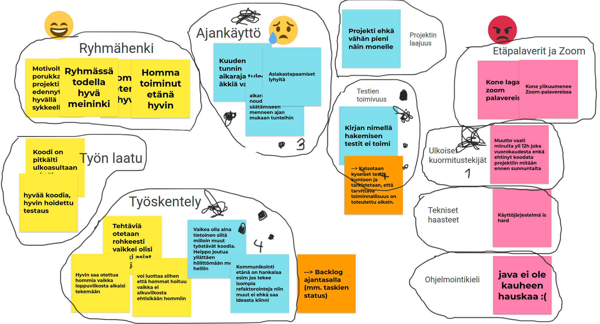

# Retro

Pidimme tiimillämme [Scrumbags](https://github.com/Latelaukki/Scrumbags) retron metodilla [Glad, Sad, Mad](http://retrospectivewiki.org/index.php?title=Glad,_Sad,_Mad). Koimme (tai ainakin itse koin) tämän hyvin speksatuksi ja helpohkoksi toteuttaa ohjeiden pohjalta. 

Haasteeksi osoittautui ajankäyttö ja tilaisuuden temmon ylläpitäminen. Tähän toki taustalla vaikutti merkittävästi Zoom-palaverin aikarajoite, sillä reilu tunnin aikana tilaisuus piti käynnistää parikin kertaa uudelleen, mikä katkaisi flown. Oli myös haastava päättää tarkalleen, mitkä olisi hyvät ajat kussakin vaiheessa toisaalta rytmin ylläpitämiseksi, mutta toisaalta tarjoten kuitenkin kaikille riittävästi aikaa miettiä. Osallistuimme kaikki keskusteluun, vaikkakin ymmärtääkseni suositeltavaa olisikin olla selkeästi yksi keskittymässä pelkästään fasilitointiin. 

Ennen tilaisuutta uskoin, että työskenneltyämme yhdessä vasta varsin vähän aikaa, tilaisuuden anti saattasi jäädä pintapuoleiseksi. Kuitenkin loppujen lopuksi esille tuli paljon hyviä huomioita ja oli positiivista nähdä myös Glad-sarakkeen useat positiiviset kommentit esimerkiksi ryhmän motivaatiosta ja työskentelyn laadusta. Pääsimme pariin todelliseen (ainakin osittain) ratkaistavissa olevaan haasteeseenkin vielä kiinni muodostaen vielä jäljellä olevan sprintin aikana toteutettavat ratkaisuehdotukset.

Työvälineenä käytimmme Google Jamboardia. Alla lopputulos:

